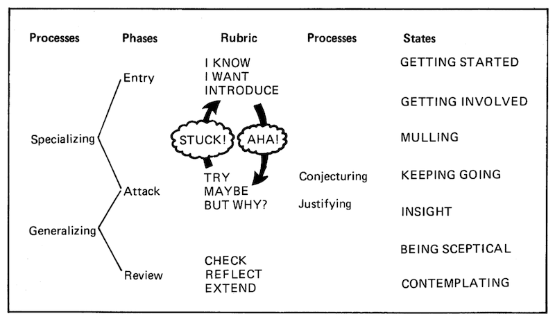

Problem solving can and should be explicitly learned. Here is a collection of tips and resources for doing that.

As software engineers, we spend all day problem solving. Yet, I've found few resources that teach the mechanics of it. 
If you want to learn a new language or technology, you can find dozens of resources. But where do you go to learn problem solving? Even algorithm
books generally give specific advice, e.g. "when you encounter a problem involving duplicates, you probably need a Set", instead
of more abstract advice, e.g. "Pin down exactly what you're trying to solve. Gather and organize everything you know about the problem space. Etc."

Let's define "problem solving". Here, problem solving means any of the challenges that software engineers face, 
from designing and implementing algorithms, to figuring out how to get data from one place to another, to debugging, to 
determining how to best re-architect an existing system, to deciding how to pitch an idea to management.

# Mechanics

To start, you should develop a framework for approaching all problems. Start with these two books. I consider them required reading.

- [Thinking Mathematically](https://amzn.to/32e3ao8) by J. Mason, L. Burton, et al.
- [How to Solve It](https://amzn.to/36pJ39F) by George Polya

Notice they're both math books. I have yet to find software engineering books targeted at problem solving.
 
I frequently refer to this diagram from Thinking Mathematically:

And this quote changed my perspective on getting stuck:

> Probably the single most important lesson to be learned is that being stuck is an honourable state and an essential part of improving thinking.

# Processes

The books above cover the act of problem solving. The tips below cover the practices and decisions surrounding problem solving.

## Do you need to solve it?

The best problem is no problem.

Given a problem, do you need to solve it? What would happen if you didn't? Would your customers care?

If you do need to solve it, can you put it off? Does it need to be solved now? 

From [The Effective Engineer](https://amzn.to/2PFRnvX) by Edmond Lau:

> The engineer that taught me the most about leverage is, without question, Paul Buchheit.
>
> More than any person I’ve ever met, Paul was willing to challenge conventional thinking, 
> and he completely changed my perspective on engineering and product management.
>
> Whenever we would encounter a challenging technical problem, I would ask “How should we do this?” Paul would respond, 
> often obnoxiously, “Why do we need to do it at all?” Instead of trying to solve impossible problems, he would more often 
> challenge the assumptions so we could simply work around them. At times, it almost seemed like Paul was lazy -- given any 
> sufficiently hard project, Paul would question the purpose of the project. But he was almost always right. Unless the 
> project was destined to make or break our nascent company, why spend our precious engineering resources on it?
 
When asking yourself the above questions, try to stay as objective as possible. Just because you find a problem compelling doesn't
mean it needs to be solved. Just because you find a problem not interesting doesn't mean it shouldn't be solved. Focus on
the needs of your customers and the business. 

Additionally, can you solve a simpler version of the problem? Or just part of it? Can you solve 80% of the problem, with 20% of
the effort required to solve the entire problem, and have a good enough solution?

Can you solve an adjacent problem that completely eliminates this one? Maybe the adjacent problem is more important or simpler.

Can you reuse someone else's solution? Can you use a tool that solves the problem? Or implement a process? Or educate your customers
so they don't run into the issue you're trying to solve? 

Are you the right person to be solving this problem? Should one of your dependencies solve it?

For a more thorough discussion on how to deliver results by building less, prioritizing aggressively, and focusing on what's essential, check out
[Getting Real](https://basecamp.com/books/getting-real/) by 37signals (it's free). 
 
## Take care of your self

Sleep, hydration, nutrition, emotional wellness, exercise, the attitudes and behavior of the people around you, 
your work environment, and stress all affect your cognitive abilities. If you want to perform your best then take care
of your self and the beings around you.

## Take a break

Let your subconscious solve your problems for you.

I've found that I have some of my most illuminating and creative ideas in the morning, after sleeping on a problem.
Your subconscious mind keeps working even after your conscious mind has quit.

From [Peak Performance](https://amzn.to/2PEsFMr) by Brad Stulberg and Steve Magness:

> Our most profound ideas often come from the small spaces in between otherwise deliberate thinking: when our brains are at rest.
> 
> Have the courage to take breaks throughout the day, especially when you are stuck or feeling unbearable stress; the more intense the work, 
> the more frequent the breaks.
  
When you're working on a tough problem and hit an impasse, take a break. Go for a walk. Listen to music. Take a shower. 
Meditate for 5 minutes. Talk to a friend. Some of your most elegant and powerful ideas come from not actively thinking.

You should also have multiple problems you're working on. Then you can take a break by switching to another problem, 
making progress on it, then switching back. Making progress on other problems motivates you and empowers you
to solve this one.

## Practice

Reading about problem solving is not enough. You get better at problem solving by solving problems. I've found small 
algorithmic problems to be a great playground for practicing the fundamentals. Check out HackerRank, TopCoder, Codewars, 
Project Euler, or any similar site.

Small problems allow you to go through the lifecycle of problem solving very quickly. This helps you learn faster. You can solve
a handful of problems in one sitting and get rapid feedback on what does and doesn't work. And since all problem solving is based on the 
same fundamental ideas, you can take those lessons into solving bigger problems.  

## Breathe

Learn to be in a state of relaxed concentration. Breathe.

From [The Power of Now](https://amzn.to/2PEtN2D) by Eckhart Tolle:

> Whenever an answer, a solution, or a creative idea is needed, stop thinking for a moment by focusing attention on your inner energy field.
> Become aware of the stillness. When you resume thinking, it will be fresh and creative.
  
## Have fun!

Remember to have fun. Building software and solving problems is a joy. Relax and enjoy the journey.

From [Arithmetic](https://amzn.to/2NCe8hI) by Paul Lockhart:

> I especially hope that I have managed to get across the idea of viewing your mind as a playground -- a place to create
> beautiful things for your own pleasure and amusement and to marvel at what you've made and at what you have yet to understand.
