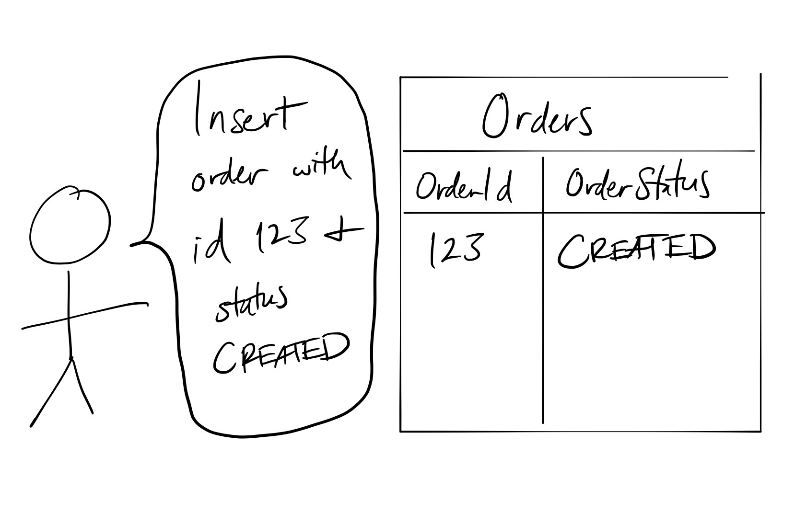
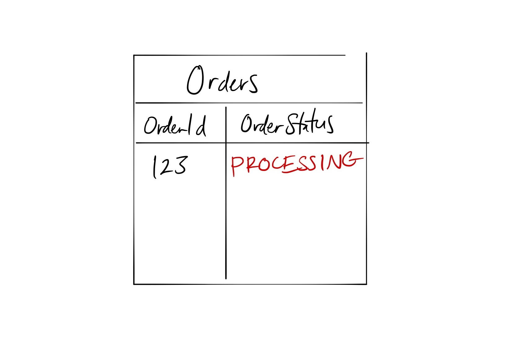
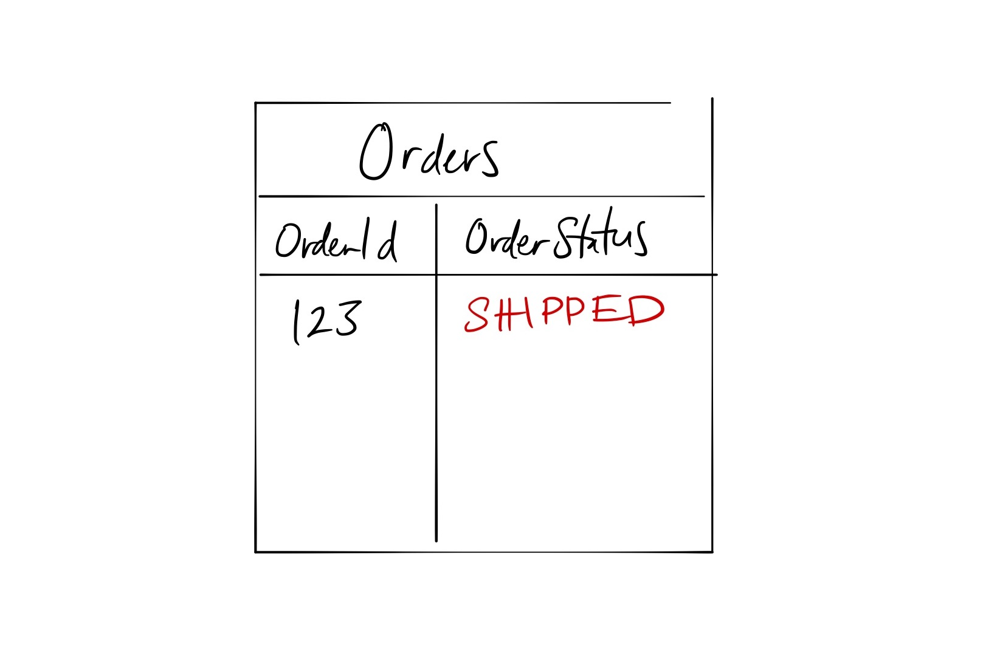
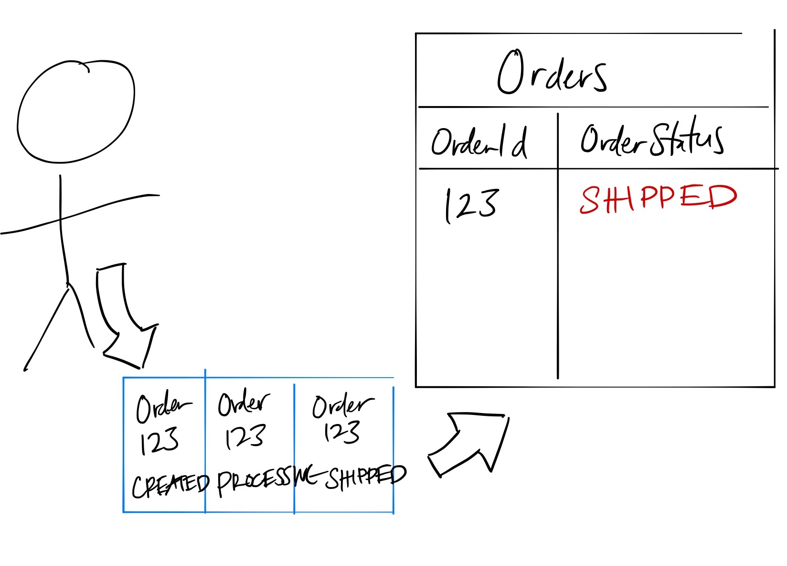
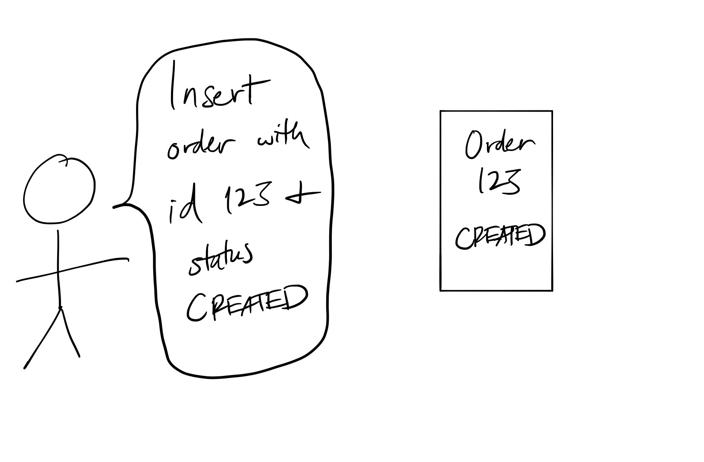
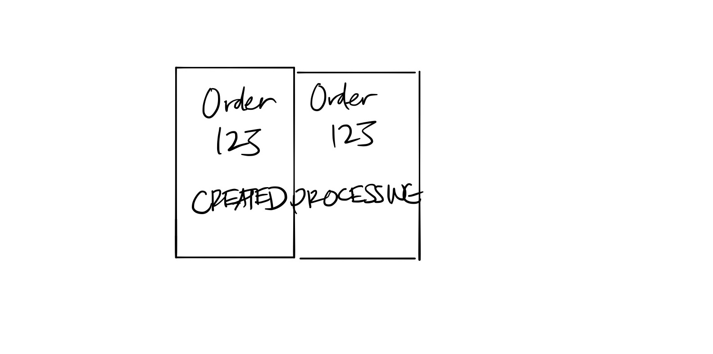
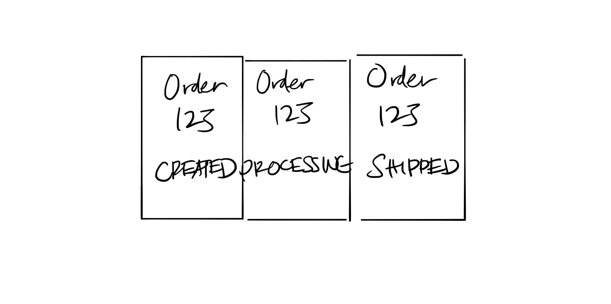
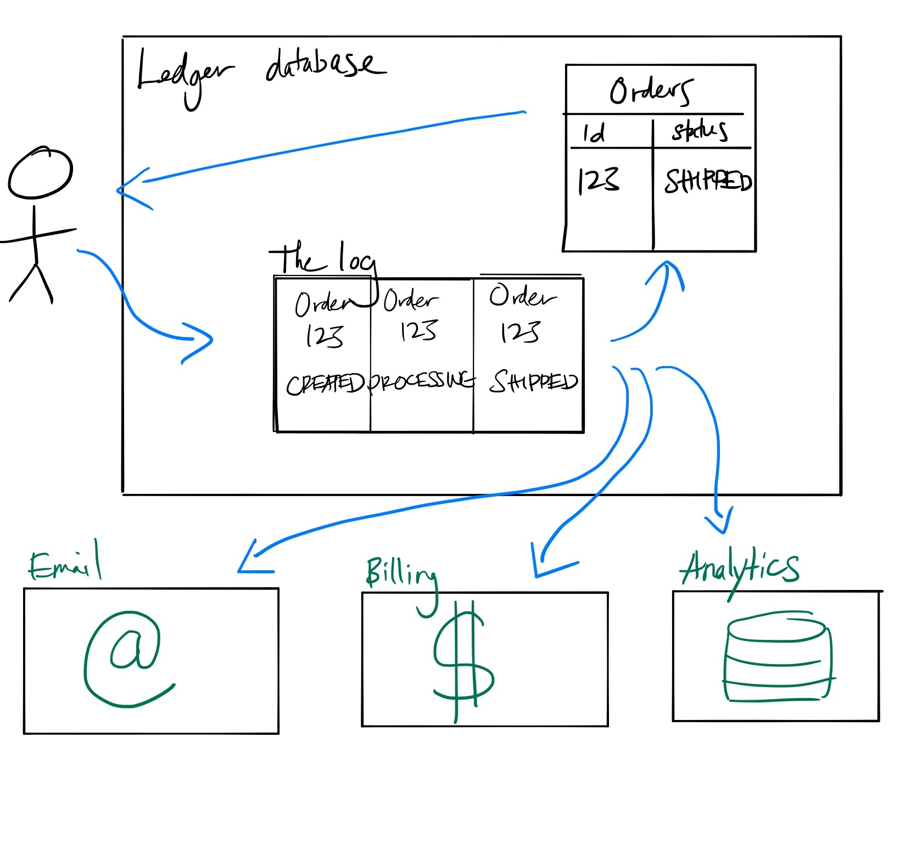

A non ledger database is table-centric. A ledger database is log-centric. The log is the database. Let's dive into what that means.

Here, the term "log" means a storage abstraction that is ["an append-only, totally-ordered sequence of records ordered by time"](https://engineering.linkedin.com/distributed-systems/log-what-every-software-engineer-should-know-about-real-time-datas-unifying).
I have diagrams later that help illustrate its structure and purpose.

# Some context

Let's start with some context. I work on AWS Quantum Ledger Database (QLDB). QLDB is the first, and currently only, commercially available ledger database.
This document does not represent AWS's official definition of a ledger database. This is my own mental model.
This document will also not be a QLDB tutorial. I will talk about the abstract concept of a ledger database, of which QLDB is one
implementation. 

This is an introduction to the ideas behind a ledger database.

# A non ledger database

Let's start by looking at typical interactions with a non ledger database.

I created a database with an Orders table. The Orders table stores order ID and order status.

I receive a new order.

An hour later, I begin working on the order. I update my table to reflect that.

An hour later, I ship the order. I once again update my Orders table.

Notice that each update to the order overwrites the past. What was the state of the order an hour ago? Two hours ago? 
My database can't tell me. 

Lets add one more detail to this diagram. 

Internally, most databases use a log. Every write to the database is [first written to the log](https://en.wikipedia.org/wiki/Write-ahead_logging) 
and then to the database. This is used to ensure atomicity and recovery from system failures. This log remembers the past but it is internal to the database.
I can't use its data. 

# A ledger database

Here is the same interaction with a ledger database.

I create an order.

I update it. 

I update it again.

**The key insight is that ledger databases remember the past.** New information doesn't overwrite the past but is instead added to it.
The log is the heart of the database and the source of truth, not the tables. Each update is appended to the log as a new entry.

Here are the key characteristics of a ledger database:

- Immutable. As in life, the past doesn't change. Each write to the database is appended to the past.
- Transparent. I have access to the past. The log's information is fully queryable.
- Verifiable. A ledger database should offer a way to validate the complete history of changes. It's not enough to have
access to historical data, you must be able to verify the authenticity of that history.

Given these properties, a ledger database makes the ideal [system of record](https://en.wikipedia.org/wiki/System_of_record) data source.
Here's an example ledger based architecture:

The ledger database contains the log and tables which are a view into the log's data. In this case, I have an Orders table which
shows the latest status of each order. That same log data is fed into an email system, which emails customers updates on their orders,
a billing system, which filters through log data and tracks each CREATED order, and a data warehouse, which is used to run analytics
on the data.

# Why "ledger"?

The term ledger represents the way we used to record information before computers. Before computers, we recorded information in books,
sometimes called ledgers, where data was only appended and you could view the past. In the early years of computers, hardware was 
expensive. Thus we built systems that update in place and use the most efficient amount of memory. Now that we're in the age of cheap, commodity 
hardware, we can revert to recording information in a more intuitive and useful way. 

# Why not use Blockchain?

I have a problem. I don't know what time it is. I need to find a device that will tell me the day and time. I can solve this problem
by buying a car. Or I can buy a wristwatch. A car can tell me the day and time, but it's not purpose built to do that. 
I have to deal with more complexity and cost than when using a watch. And I miss some of the features available in a device built for
time telling, such as a timer.

In the same way, a blockchain contains within it a distributed ledger, which can be used as a ledger database. But it comes with unnecessary
complexity and limitations. For example, given that ledgers are decentralized, meaning multiple parties create and share the data, and ledger
databases are not, a ledger database will support higher transactions per second.

# More info:

- ["The log is the database."](https://datatechnologytoday.wordpress.com/2014/02/10/the-log-is-the-database/)
- [The Log: What every software engineer should know about real-time data's unifying abstraction](https://engineering.linkedin.com/distributed-systems/log-what-every-software-engineer-should-know-about-real-time-datas-unifying)
- [Rich Hickey's "Deconstructing the Database"](https://www.youtube.com/watch?v=Cym4TZwTCNU)
- [Short intro to QLDB](https://www.youtube.com/watch?v=jcZ_rsLJrqk)
- [Initial re:Invent talk on QLDB](https://www.youtube.com/watch?v=7G9epn3BfqE)
