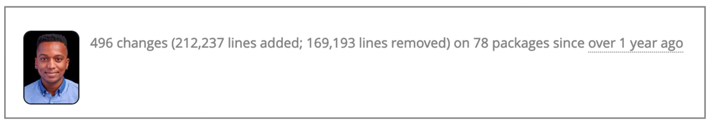
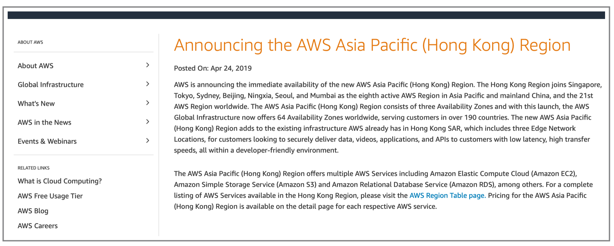
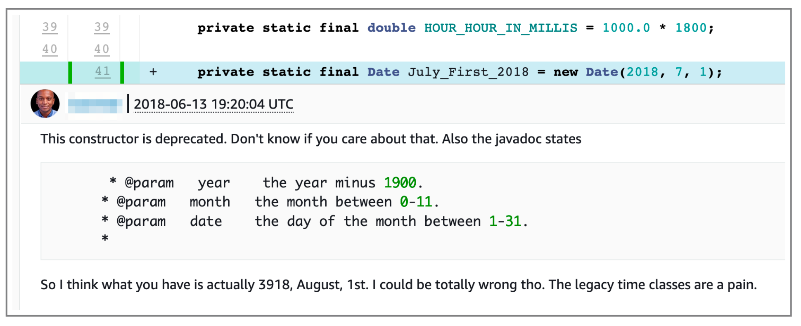

Wow. I've officially been a software engineer for a year. Here are some thoughts on that year. 

# A unique perspective

I was hired at Amazon Web Services (AWS) in December 2018, following a three month internship. 
I have a unique background compared to most engineers around me -- I don't have a computer science or
STEM degree. In fact, I don't have any degree. I started learning about tech in 2014 through a boot camp called
[Year Up](https://www.yearup.org/). That bootcamp led to a job at Amazon as a Quality Assurance Technician. 
After a few promotions, and a year through another program called Amazon Technical Academy, I earned a software 
engineering role at AWS.

# Highs and lows

AWS is known for it's rigorous, fast paced, and intense engineering culture. It's been a whirlwind year. I experienced
many junior software engineer firsts, including:

- First time posting a code review for production code.
- First time reviewing code reviews for production code.
- First time deploying code to production. And to multiple AWS regions.
- First time writing a design for a production feature.
- First time reviewing a design for a production feature.
- First time breaking the build for a production system.
- First time sending a pull request for code not owned by my team.
- First time implementing tooling used by others.
- First time interacting with customers of a product I work on.
- First time fixing a bug in production.
- First time pushing a bug to production.
- First time going oncall.
- First time getting paged in the middle of the night while oncall.
- First time presenting on a technical topic to a group of people.
- First time introducing a new technology (Kotlin) to a team.
- First time rewriting an application (Java to Kotlin).
- First time finding a security issue.
- First time undergoing a performance review as a software engineer.

And many more.

I encountered many problems I'd never seen before. Some of them seemed insurmountable. But I always got through it. I was
fortunate to be surrounded by many kind and talented engineers and managers.

In total, I made close to 500 code changes from the time I was an intern through 2019. 

Being a software engineer changed my life and my lifestyle. I can afford to take good care of myself and my family. I can
travel. I see the world through the lens of systems thinking.

And I learned so much. I can't put into words how much I learned. About engineering, distributed systems, working on
a team, communication, the JVM, the terminal, AWS, deployments, programming, writing, reading, learning, mentorship, how
capable I am, and so much more.

Out of everything I learned, here are three major takeaways.

# Lessons learned

## More than code

_A launch I worked on: Hong Kong region launch, AWS's first opt-in region._

Based on the extreme emphasis on data structures/algorithms and solving whiteboard interview problems, and how software
engineers are portrayed in media, I expected that software engineers spent all day coding. That is definitely not the case
at Amazon. Software engineers own the entire software development lifecycle, including ideation, requirements gathering, 
design, coding, testing, documentation, deployments, security, system performance, and system maintenance. 
While I did spend about half my time coding, I also spent a lot of time doing other things. 

It takes a certain level of coding skills to get into Amazon as a software engineer, but once you're here, moving up depends 
on excelling in all those other areas. In other words, being a brilliant coder only gets you so far. You have to develop the 
ability to view and understand the entire software development lifecycle and how it relates to the systems your team owns,
what the business needs, and what customers want.

This was an eye opening lesson for me. 

## Learning, learning, learning

_Bugs come in all shapes and sizes. Found this in a code review. I spent a lot of time reviewing code. And learning about communicating with others through code reviews._

Software engineering is for people who love learning. This field has so much to teach, and it's changing every day. 
I happen to really love learning. I'm grateful to work in a field that rewards learners: people who collect and then synthesize 
their knowledge, who invent new solutions and simplify current solutions. 

I read many books in the past year. Here are a few that uniquely impacted my perspective on learning:
- [Peak Performance](https://amzn.to/2PEsFMr) by Brad Stulberg and Steve Magness
- [The Effective Engineer](https://amzn.to/2PFRnvX) by Edmond Lau
- [Talent is Overrated: What Really Separates World-Class Performers from Everybody Else](https://amzn.to/39jbHKf) by Geoff Colvin
- [Make It Stick: The Science of Successful Learning](https://amzn.to/2SasIAD) by Peter C. Brown, Henry L. Roediger III, and Mark A. McDaniel

## Be grateful but never settle

I really enjoyed the team I interned and was hired on to. But, six months after being hired, I concluded that the team wasn't
the optimal fit for me. On one hand, I loved the team and was grateful they hired me. On the other hand, I wasn't getting 
everything I wanted. So I made the decision to look for a new team. I then took the risk of leaving something pretty good 
for something uncertain. Luckily it worked out. I'm getting everything I want on my current team.

Just like I never want to stop learning and growing, I never want to settle. This is the only life I get and I want to 
maximize it. This requires taking calculated risks and knowing when it's ok to move on.

# What's next?

I love being a software engineer. I can't imagine a job that suits by interests and talents better. For the time being, I 
will continue to build software products and grow as a person and engineer. I love the cloud and I love AWS so I imagine 
I'll continue to be here for the near future as well.

I spent most of my first year wrapping my head around the full software development lifecycle. Most of that learning was 
through small tasks and implementing the designs of others. I'm looking forward to taking that knowledge and using it to
design and build my own ideas this year.
   